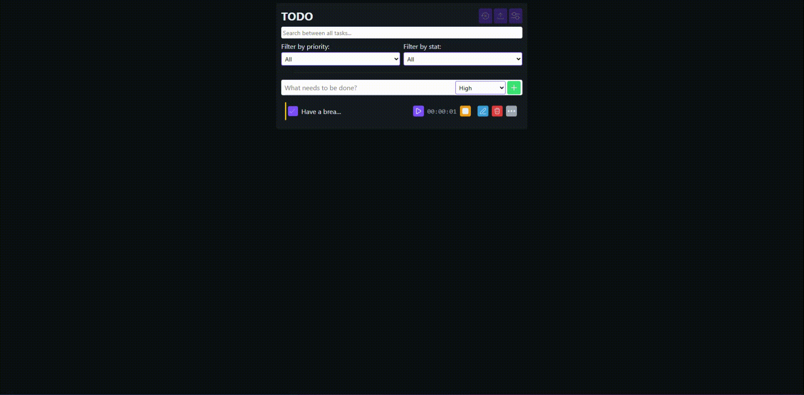
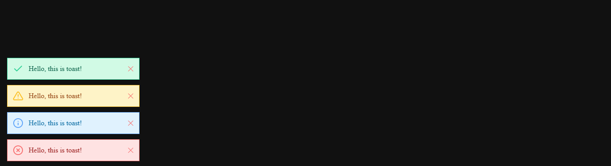

# ToasterJS
A solid, light-weight and simple Javascript library for toasting modern and beautiful notifications on your website!



## Features
- Animational entry and exit
- Supports different position of screen to toast
- Toast duration
- Toast direction
- Rounded style or non-rounded style
- Toasts number limit
- Support queue system
- Modern color and style
- SVG icons
- Support manually close
- Support light and dark theme colors



## Installation
There is no hard thing to do bro! Just use it in your project.(But read the USAGE section before!).

## Usage
### Minify version:
1- add this to html file:
```html
<link rel="stylesheet" href="./path-to-lib/toaster.css">
<script src="./path-to-lib/Toaster.js" defer></script>
```
2- Use this code on your JS file(Create the object once and use the method everywhere):
```javascript
const toast = new ToasterJS();
toast.toast("I'm using ToasterJS!!!", ToasterJS.INFO);
```

### Minify modular version:
1- add this to html file:
```javascript
<link rel="stylesheet" href="./path-to-lib/toaster.css">
<script type="module" src="./path-to-lib/Toaster.js" defer></script>
<script type="module" src="./path-to-your-js" defer></script>
```
2- Use this code on your JS file(Create the object once and use the method everywhere):
```javascript
import { ToasterJS } from "./path-to-lib/Toaster.js";
const toast = new ToasterJS();
toast.toast("I'm using ToasterJS!!!", ToasterJS.INFO);
```

## How to toast?
Good question. take a look at this doc:
After you create the ToasterJS object you can access a method called `toast(message, type)`. in this method you should type your text or message to show and pass the type from the ToasterJS class! how?
Using the ToasterJS constants! This will effects on the message type and color!
- ToasterJS.INFO        => `toast("hello", ToasterJS.INFO)`
- ToasterJS.SUCCESS     => `toast("hello", ToasterJS.SUCCESS)`
- ToasterJS.ERROR       => `toast("hello", ToasterJS.ERROR)`
- ToasterJS.WARNING     => `toast("hello", ToasterJS.WARNING)`
this method will toast your message. But! The ToasterJS class has a constructor that will give you more thing and options! Like this:
`new ToasterJS(animation, position, duration, direction, rounded, limit, queue);`
- animation: It points to the entry and exit animation of toast!
Values:
ToasterJS.FADE
ToasterJS.SLIDE_UP
ToasterJS.SLIDE_DOWN
ToasterJS.SLIDE_LEFT
ToasterJS.SLIDE_RIGHT
- position: It points to the position of toast in the screen!
Values:
ToasterJS.TOP_LEFT
ToasterJS.TOP_RIGHT
ToasterJS.BOTTOM_LEFT
ToasterJS.BOTTOM_RIGHT
- duration: It points to the duration of toast!
Values: `Any number except lower 0`
- direction: It points to the direction of the toast!
Values:
ToasterJS.LTR
ToasterJS.RTL
- rounded: It points to the roundness of toast!
Values: `true or false`
- limit: It points to the limited number of toasts shown at once!
Values: `Any number - use -1 for unlimit toast number`
- queue: It points to that how to show the overflow toasts?
Values: `true or false‍‍`
If you set this option to true, extra toasts will wait in a queue and show up one by one after the toast container reaches its limit.
If you set it to false, extra toasts will appear immediately by removing the oldest toast in the container and replacing it with the new one.
